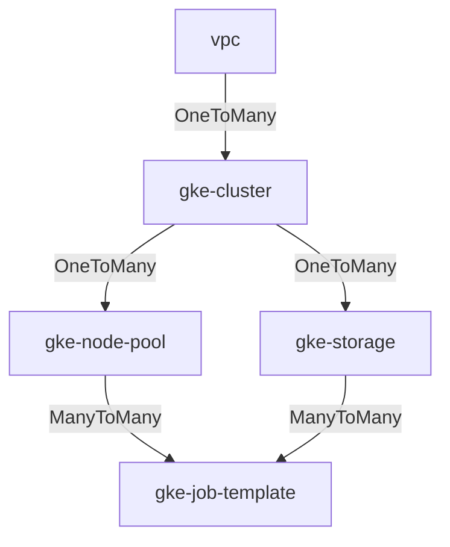

## Description

This module creates Kubernetes Storage Class (SC) that can be used by a Persistent Volume Claim (PVC)
to dynamically provision GCP storage resources like Parallelstore.

### Example

The following example uses the `gke-storage` module to creates a Parallelstore Storage Class and Persistent Volume Claim,
then use them in a `gke-job-template` to dynamically provision the resource.

```yaml
  - id: gke_cluster
    source: modules/scheduler/gke-cluster
    use: [network]
    settings:
      enable_parallelstore_csi: true

  - id: private_service_access
    source: community/modules/network/private-service-access
    use: [network]
    settings:
      prefix_length: 24

  - id: gke_storage
    source: modules/file-system/gke-storage
    use: [ gke_cluster, private_service_access ]
    settings:
      storage_type: Parallelstore
      access_mode: ReadWriteMany
      sc_volume_binding_mode: Immediate
      sc_reclaim_policy: Delete
      sc_topology_zones: [$(vars.zone)]
      pvc_count: 2
      capacity_gb: 12000

  - id: job_template
    source: modules/compute/gke-job-template
    use: [gke_storage, compute_pool]
```

See example
[gke-managed-parallelstore.yaml](../../../examples/README.md#gke-managed-parallelstoreyaml--) blueprint
for a complete example.

### Authorized Network

Since the `gke-storage` module is making calls to the Kubernetes API
to create Kubernetes entities, the machine performing the deployment must be
authorized to connect to the Kubernetes API. You can add the
`master_authorized_networks` settings block, as shown in the example above, with
the IP address of the machine performing the deployment. This will ensure that
the deploying machine can connect to the cluster.

### Connecting Via Use

The diagram below shows the valid `use` relationships for the GKE Cluster Toolkit
modules. For example the `gke-storage` module can `use` a
`gke-cluster` module and a `private_service_access` module, as shown in the example above.



## License

<!-- BEGINNING OF PRE-COMMIT-TERRAFORM DOCS HOOK -->
## Inputs

| Name | Description | Type | Default | Required |
|------|-------------|------|---------|:--------:|
| access\_mode | The access mode that the volume can be mounted to the host/pod. More details in [Access Modes](https://kubernetes.io/docs/concepts/storage/persistent-volumes/#access-modes)<br>Valid access modes:<br>- ReadWriteOnce<br>- ReadOnlyMany<br>- ReadWriteMany<br>- ReadWriteOncePod | `string` | n/a | yes |
| capacity\_gb | The storage capacity with which to create the persistent volume. | `number` | n/a | yes |
| cluster\_id | An identifier for the GKE cluster in the format `projects/{{project}}/locations/{{location}}/clusters/{{cluster}}` | `string` | n/a | yes |
| labels | GCE resource labels to be applied to resources. Key-value pairs. | `map(string)` | n/a | yes |
| mount\_options | Controls the mountOptions for dynamically provisioned PersistentVolumes of this storage class. | `string` | `null` | no |
| private\_vpc\_connection\_peering | The name of the VPC Network peering connection.<br>If using new VPC, please use community/modules/network/private-service-access to create private-service-access and<br>If using existing VPC with private-service-access enabled, set this manually follow [user guide](https://cloud.google.com/parallelstore/docs/vpc). | `string` | `null` | no |
| project\_id | The project ID to host the cluster in. | `string` | n/a | yes |
| pv\_mount\_path | Path within the container at which the volume should be mounted. Must not contain ':'. | `string` | `"/data"` | no |
| pvc\_count | How many PersistentVolumeClaims that will be created | `number` | `1` | no |
| sc\_reclaim\_policy | Indicate whether to keep the dynamically provisioned PersistentVolumes of this storage class after the bound PersistentVolumeClaim is deleted.<br>[More details about reclaiming](https://kubernetes.io/docs/concepts/storage/persistent-volumes/#reclaiming)<br>Supported value:<br>- Retain<br>- Delete | `string` | n/a | yes |
| sc\_topology\_zones | Zone location that allow the volumes to be dynamically provisioned. | `list(string)` | `null` | no |
| sc\_volume\_binding\_mode | Indicates when volume binding and dynamic provisioning should occur and how PersistentVolumeClaims should be provisioned and bound.<br>Supported value:<br>- Immediate<br>- WaitForFirstConsumer | `string` | `"WaitForFirstConsumer"` | no |
| storage\_type | The type of [GKE supported storage options](https://cloud.google.com/kubernetes-engine/docs/concepts/storage-overview)<br>to used. This module currently support dynamic provisioning for the below storage options<br>- Parallelstore<br>- Hyperdisk-balanced<br>- Hyperdisk-throughput<br>- Hyperdisk-extreme | `string` | n/a | yes |

## Outputs

| Name | Description |
|------|-------------|
| persistent\_volume\_claims | An object that describes a k8s PVC created by this module. |

<!-- END OF PRE-COMMIT-TERRAFORM DOCS HOOK -->
